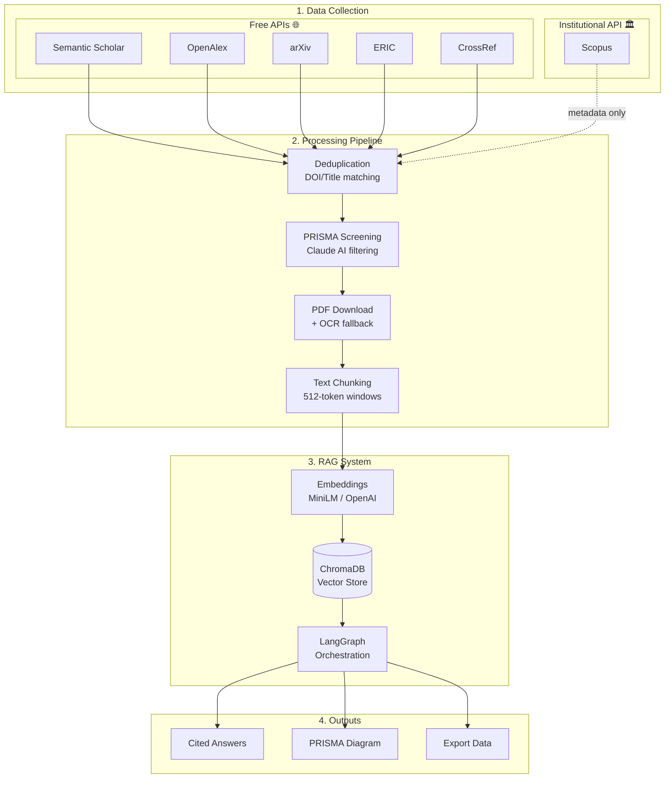

# ScholaRAG


**Conversation-based automation for PRISMA-ready research RAGs.**

[](https://opensource.org/licenses/MIT)
[](https://www.python.org/downloads/)
[](https://researcher-rag-helper.vercel.app/)

---

## TL;DR

> **Turn weeks of manual literature review into hours** — ~30min setup, 2–4h pipeline, ~$20/mo (Claude Pro).

| Mode | What You Get | Papers | Time | Best For |
|------|--------------|--------|------|----------|
| **Knowledge Repository** | 15K–20K doc vector DB | 50% retention | 2–4h | Broad domain exploration |
| **Systematic Review** | 50–300 paper PRISMA RAG | 90% filter (2–10% kept) | 3–5h | Publication-ready synthesis |

---

## Quick Start (VS Code + Claude Code)

### First-Time Setup

Copy-paste this to Claude Code:

```
Please set up ScholaRAG for me:
1. Clone https://github.com/HosungYou/ScholaRAG.git
2. Create Python virtual environment
3. Install dependencies
4. Run: python scholarag_cli.py init
5. Guide me through Stage 1
```

### Returning Users

```
Continue my ScholaRAG project in [project_folder].
Show current status and guide me to the next stage.
```

*Full setup guide: [CLAUDE.md](CLAUDE.md)*

---

## 7-Stage Workflow

| Stage | Action | Prompt File | Output |
|:-----:|--------|-------------|--------|
| 1 | **Domain Setup** — scope & sources | `prompts/01_research_domain_setup.md` | Domain profile |
| 2 | **Query Strategy** — keywords & queries | `prompts/02_query_strategy.md` | Search configuration |
| 3 | **PRISMA Config** — include/exclude criteria | `prompts/03_prisma_configuration.md` | Screening rules |
| 4 | **RAG Design** — chunking & embeddings | `prompts/04_rag_design.md` | Technical spec |
| 5 | **Execution** — run pipeline scripts | `prompts/05_execution_plan.md` | Processed data |
| 6 | **Research Q&A** — cited evidence queries | `prompts/06_research_conversation/` | Answers + citations |
| 7 | **Documentation** — PRISMA diagram & methods | `prompts/07_documentation_writing.md` | Draft manuscript |

**Scripts:** `scripts/01_fetch_papers.py` → `02_deduplicate.py` → ... → `07_generate_prisma.py`

---

## Architecture

```
Collect → Deduplicate → PRISMA Screen → PDF/OCR → Chunk → Embed → Vector DB → Query
```



**Data Sources (6 Databases):**
| Database | Access | Papers | PDF Access | API Key |
|----------|--------|--------|------------|---------|
| **Semantic Scholar** | Free | 200M+ | ~40% OA | Optional (recommended) |
| **OpenAlex** | Free | 260M+ | ~50% OA | Not required |
| **arXiv** | Free | 2M+ | 100% | Not required |
| **ERIC** | Free | 1.8M+ | ~60% | Not required |
| **CrossRef** | Free | 156M+ | Variable | Not required |
| **Scopus** | Institutional | 90M+ | Metadata only | Required |

> **Note:** "Free" = Freely accessible to anyone. "Institutional" = Requires institutional affiliation or subscription.

**Core Stack:**
- **Vector DB:** ChromaDB (local, zero-cost)
- **Orchestration:** LangGraph for multi-step retrieval
- **Embeddings:** `all-MiniLM-L6-v2` (local) or `text-embedding-3-small` (OpenAI)
- **PDF/OCR:** PyMuPDF, pdfplumber, Tesseract

---

## v1.2.6 Features

ScholaRAG v1.2.6 introduces major improvements for production-grade research automation.

### LLM Provider Abstraction

Support for multiple LLM providers with unified API:

| Provider | Cost | Speed | Best For |
|----------|------|-------|----------|
| **Claude (Anthropic)** | ~$20/mo | Standard | Default, best reasoning |
| **Groq** | ~$0.50/mo | 100x faster | Budget-conscious, high volume |
| **Ollama (Local)** | $0 | Variable | Privacy-first, offline |

**Example:** Screen 10,000 papers at $0.01 per 100 papers with Groq instead of $20 with Claude Pro.

**Setup:**
```bash
# Use Groq for cost-effective screening
export LLM_PROVIDER=groq
export GROQ_API_KEY=your_key_here
python scholarag_cli.py init --name "GroqProject" --question "..." --llm-provider groq
```

### Security Updates

Enterprise-grade security for API access:

- **API Key Authentication**: X-API-Key header validation for all endpoints
- **CORS Configuration**: Configurable cross-origin resource sharing with whitelist support
- **Localhost Binding**: Secure default binding to 127.0.0.1 (configurable for deployment)
- **Environment Isolation**: API keys never logged or exposed in error messages

**Example configuration:**
```yaml
# config.yaml
security:
  auth_enabled: true
  api_key_header: X-API-Key
  cors_origins:
    - http://localhost:3000
    - https://yourdomain.com
  bind_address: 127.0.0.1
  bind_port: 8000
```

### Token-Based Chunking

Accurate text chunking using `tiktoken` for reliable LLM processing:

- **Previous**: Character-based chunking (unreliable token counts)
- **New**: Token-based chunking with configurable window sizes
- **Default**: 500-token windows with 50-token overlap
- **Benefit**: Eliminates truncation surprises, improves RAG accuracy

**How it works:**
```python
# Automatic token counting via tiktoken
from scholarag.chunking import TokenChunker

chunker = TokenChunker(
    model="gpt-3.5-turbo",  # Auto-selects appropriate tokenizer
    token_window=500,
    overlap=50
)

chunks = chunker.chunk_text(pdf_text)  # Returns evenly-sized chunks by tokens
```

### Unified File Conventions

Standardized output file naming across all 7 pipeline stages:

| Stage | Output File | Format |
|-------|-------------|--------|
| 1 | `stage_01_identified.jsonl` | Papers from all databases |
| 2 | `stage_02_deduplicated.jsonl` | Unique papers only |
| 3 | `stage_03_screened.jsonl` | Inclusion decisions + confidence |
| 4 | `stage_04_pdfs_retrieved.jsonl` | PDF metadata + retrieval status |
| 5 | `stage_05_chunks.jsonl` | Text chunks with token counts |
| 6 | `stage_06_embeddings.jsonl` | Vector embeddings + metadata |
| 7 | `stage_07_prisma_diagram.json` | PRISMA flowchart data |

**Benefits:**
- Predictable file locations for scripting
- Easy pipeline resumption at any stage
- Clear audit trail of decisions
- Batch processing of any stage

---

## Operating Modes

| | Knowledge Repository | Systematic Review |
|---|:---:|:---:|
| **Goal** | Domain knowledge base | PRISMA-compliant shortlist |
| **Input** | 20K–30K papers | 1K–5K screened |
| **Filter** | 50% (dedup + spam) | 90% (strict criteria) |
| **Output** | 15K–20K vectors | 50–300 curated papers |
| **Use Case** | Landscape scanning, exploration | Thesis, publication, grant |

---

## Templates

Pre-configured domain profiles in `templates/research_profiles/`:

| Template | Domain | Databases Focus |
|----------|--------|-----------------|
| `education` | EdTech, Learning Sciences | ERIC, pedagogy-focused |
| `medicine` | Clinical, Public Health | PubMed, RCT-style |
| `social_science` | Psychology, Sociology | PsycINFO-style |
| `hrm` | HR, Organizational | Workplace interventions |
| `default` | General | Balanced baseline |

**Custom:** Copy `default.yaml` → edit sources/criteria → use with `--template custom`

---

## Example: AI Chatbots for Language Learning

| Metric | Value |
|--------|-------|
| Initial search | 21,234 papers |
| After dedup | 15,892 |
| PRISMA retained | 342 (2.2%) |
| PDFs retrieved | 287 (84%) |
| Final RAG | 3,421 chunks |

**Sample output:** *"RCTs show speaking fluency gains of 15–30% with AI chatbot interventions, with pause time reductions of ~40% (23 citations, avg similarity 0.85)."*

→ [Full case study](https://researcher-rag-helper.vercel.app/guide/05-advanced-topics)

---

## Cost & ROI

| Item | Cost | Notes |
|------|------|-------|
| Setup (venv, deps) | $0 | ~30 min |
| Local embeddings | $0 | MiniLM included |
| LLM (Claude) | ~$20/mo | Claude Pro (default) |
| LLM (Groq option) | ~$0.50/mo | 100x cheaper, same quality screening |
| OpenAI embeddings | ~$2–5 | Optional, for scale |
| **Total (Claude)** | **~$20/mo** | **67–75% time savings** |
| **Total (Groq)** | **~$0.50/mo** | **Same savings, minimal cost** |

*Traditional systematic review: 6–8 weeks → ScholaRAG: 2–3 weeks*

---

## API Key Setup

ScholaRAG supports 6 academic databases. Most work without an API key, but some can improve performance with one.

### Free APIs (Freely Accessible)

| Database | API Key | Rate Limit | Setup |
|----------|---------|------------|-------|
| **Semantic Scholar** | Optional | 100 req/5min → 1,000 req/5min (with key) | [Get free key](https://www.semanticscholar.org/product/api#api-key) |
| **OpenAlex** | Not required | 100K req/day (polite pool) | Add `mailto` param for priority |
| **arXiv** | Not required | 3 sec delay required | No setup needed |
| **ERIC** | Not required | 2,000 results max | No setup needed |
| **CrossRef** | Not required | Unlimited (polite pool) | Add `mailto` param for priority |

### Institutional APIs (Requires Affiliation)

| Database | Requirement | Setup |
|----------|-------------|-------|
| **Scopus** | Elsevier developer account + institutional affiliation | [dev.elsevier.com](https://dev.elsevier.com/) |

### Setup Instructions

**1. Semantic Scholar (Recommended)**
```bash
# 1. Visit: https://www.semanticscholar.org/product/api#api-key
# 2. Sign up with email
# 3. Copy API key
# 4. Add to project .env:
SEMANTIC_SCHOLAR_API_KEY=your_key_here
```

**2. OpenAlex (No Setup Required)**
- Works without API key
- Code automatically sets `mailto` parameter (polite pool)

**3. arXiv (No Setup Required)**
- Works without API key
- 3-second delay automatically applied

**4. ERIC (No Setup Required)**
- Works without API key
- Max 2,000 results per query

**5. CrossRef (No Setup Required)**
- Works without API key
- Code automatically sets `mailto` parameter

**6. Scopus (Institutional Only)**
```bash
# 1. Visit: https://dev.elsevier.com/
# 2. Create account (requires institutional email)
# 3. Request API access
# 4. Add to project .env:
SCOPUS_API_KEY=your_key_here
```

### .env File Example
```env
# Required for PRISMA screening
ANTHROPIC_API_KEY=sk-ant-...

# Optional: Faster Semantic Scholar access
SEMANTIC_SCHOLAR_API_KEY=your_key_here

# Institutional: Scopus access
SCOPUS_API_KEY=your_key_here
```

---

## Repository Structure

```
ScholaRAG/
├── prompts/              # 7-stage conversation templates
├── templates/            # Domain research profiles
├── scripts/              # Pipeline scripts 01–07
├── interfaces/           # Streamlit & FastAPI apps
├── scholarag_cli.py      # Main CLI tool
└── CLAUDE.md             # AI assistant instructions
```

---

## Contributing

Issues, PRs, and template contributions welcome:
- [Issues](https://github.com/HosungYou/ScholaRAG/issues)
- [Discussions](https://github.com/HosungYou/ScholaRAG/discussions)

## Citation

```bibtex
@software{scholarag2025,
  author = {You, Hosung},
  title = {ScholaRAG: Conversation-Based Systematic Literature Review Automation},
  year = {2025},
  url = {https://github.com/HosungYou/ScholaRAG},
  version = {1.3.0}
}
```

## License

[MIT License](LICENSE)

---

**[Docs](https://researcher-rag-helper.vercel.app/)** · **[Chat Demo](https://researcher-rag-helper.vercel.app/chat)** · **[GitHub](https://github.com/HosungYou/ScholaRAG)**
